# Manual do sistema P&S Cobranças

O sistema da P&S Cobranças organiza o serviço de pagar as contas das empresas clientes. Cada boleto vira uma conta com a NF-e anexada, e o sistema calcula sozinho quanto você recebe: 5% da nota no atacado e 4% no varejo.

## Como o sistema funciona

Cada conta passa por quatro etapas, na mesma ordem do seu dia a dia:

1. **Lançar a conta**: a empresa manda o boleto e a nota. Você registra vencimento, NF-e (com o arquivo), valor da NF, empresa recebedora, atacado/varejo e matriz/filial.
2. **Registrar o repasse**: quando a empresa manda o valor, você marca "repasse recebido". A conta passa a ficar *Pronta para pagar*.
3. **Pagar o boleto**: você paga no banco e registra a data, a forma e, se quiser, o comprovante.
4. **Receber sua taxa**: no fim do mês, a tela de Fechamento soma as taxas por empresa, separadas em atacado e varejo, e você marca quando recebeu.

A situação de cada conta aparece com uma cor:

| Situação | O que significa |
| --- | --- |
| Aguardando repasse | A empresa ainda não enviou o valor |
| Pronto p/ pagar | O valor já chegou; falta pagar o boleto |
| Vencido | Passou do vencimento sem pagamento |
| Pago | Boleto pago; a taxa entra no fechamento do mês |
| Cancelado | Saiu da lista e não entra no fechamento |

## Entrar no sistema

Abra o endereço do sistema e entre com o seu e-mail e senha. Quem cadastra os acessos é a administradora, no Supabase (veja [SUPABASE.md](SUPABASE.md)).

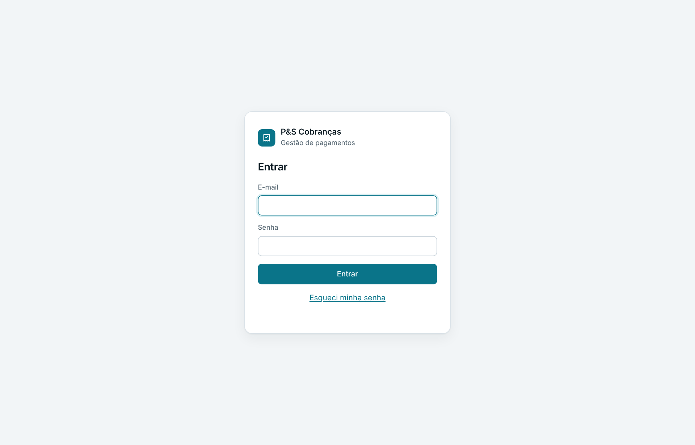

- **Esqueci minha senha:** digite o e-mail e clique no link. Chega um e-mail com o link para criar uma senha nova.
- **Sair:** no rodapé do menu lateral, ao lado do seu e-mail.

Para testar o sistema antes de lançar as contas reais, clique em **Carregar exemplos** no Painel. Os exemplos são removidos depois em Ajustes (passo 7).

## Passo 1: cadastrar a empresa cliente

Toda conta pertence a uma empresa cliente (quem te contrata). Cadastre cada empresa uma única vez.

1. No menu lateral, clique em **Empresas clientes**.
2. Clique em **Nova empresa**, no canto superior direito.
3. Preencha nome, CNPJ, responsável, telefone e e-mail. Use **Observações** para anotar filiais ou a conta para onde ela faz o repasse.
4. Clique em **Cadastrar empresa**.

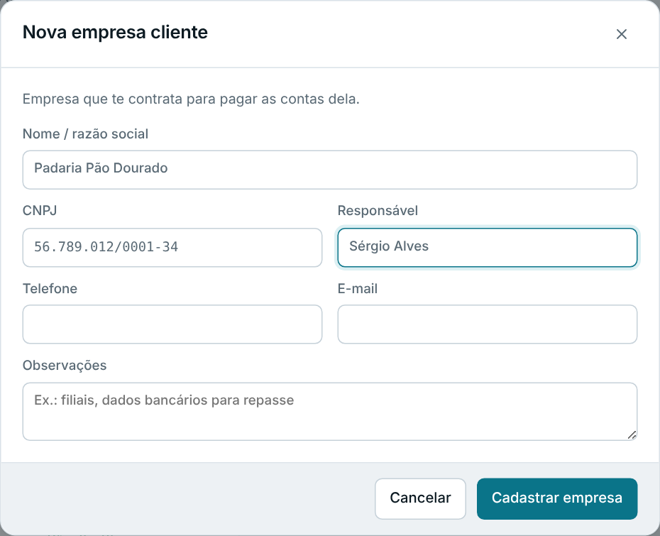

Cada empresa ganha um cartão com o que está a pagar, o que ainda não teve repasse, o que foi pago no mês e a sua taxa no mês. Pelo cartão você já pode **Lançar conta** para aquela empresa ou **Ver contas** dela.

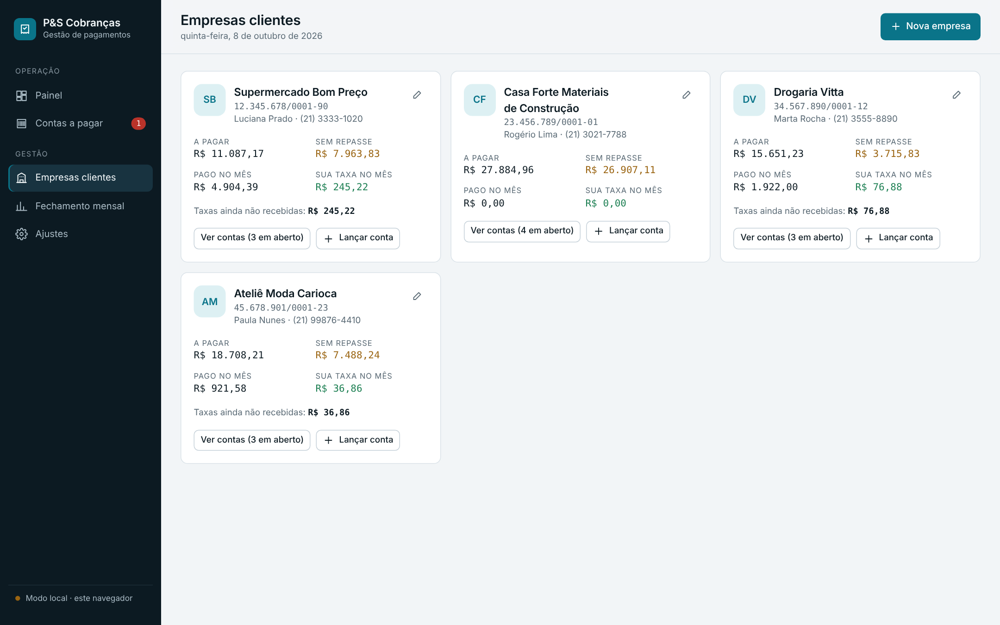

## Passo 2: lançar a conta (boleto + NF-e)

É aqui que entram os dados da sua planilha. Clique em **Nova conta** (no Painel ou em Contas a pagar) e preencha:

| Campo | O que colocar |
| --- | --- |
| Empresa cliente | Quem pediu o pagamento |
| Tipo de empresa | Matriz ou Filial |
| Tipo de transação | Atacado ou Varejo; define a sua taxa |
| Empresa recebedora da nota | O fornecedor que vai receber; o sistema sugere os nomes já usados |
| CNPJ do recebedor | Opcional |
| Nº da NF-e | Número da nota fiscal |
| Valor da NF | Base do cálculo da taxa |
| Valor do boleto | Deixe vazio se for igual ao da NF |
| Data de vencimento | Vencimento do boleto |
| Linha digitável | Opcional; depois você copia com um clique |

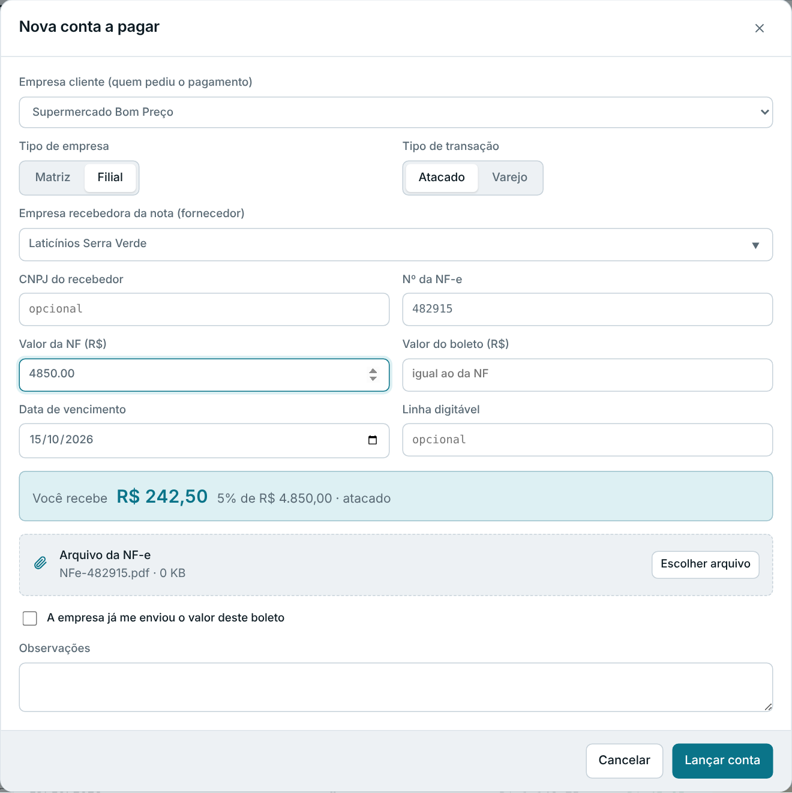

**Valor a receber:** a caixa azul mostra na hora quanto você ganha com aquela conta. Atacado = 5% do valor da NF; varejo = 4%. Ao trocar para Varejo, o valor muda na mesma hora:

**Arquivo da NF-e:** clique em **Escolher arquivo** ou arraste o PDF/XML da nota para a área tracejada. O arquivo fica guardado junto da conta, e qualquer pessoa da equipe abre com um clique. Aceita PDF, XML e imagens de até 20 MB.

Se a empresa já mandou o dinheiro, marque **A empresa já me enviou o valor deste boleto**: a conta já entra como *Pronta para pagar*. Clique em **Lançar conta** para salvar.

## Passo 3: registrar o repasse da empresa

Quando a empresa transferir o valor do boleto para você, registre o repasse. Assim você nunca paga uma conta com dinheiro que ainda não chegou.

1. Abra **Contas a pagar** e clique na aba **Aguardando repasse**. Ela lista só as contas cujo valor a empresa ainda não mandou.
2. Na linha da conta, clique em **Repasse**.
3. Confira a data e o valor recebido e clique em **Confirmar repasse**.

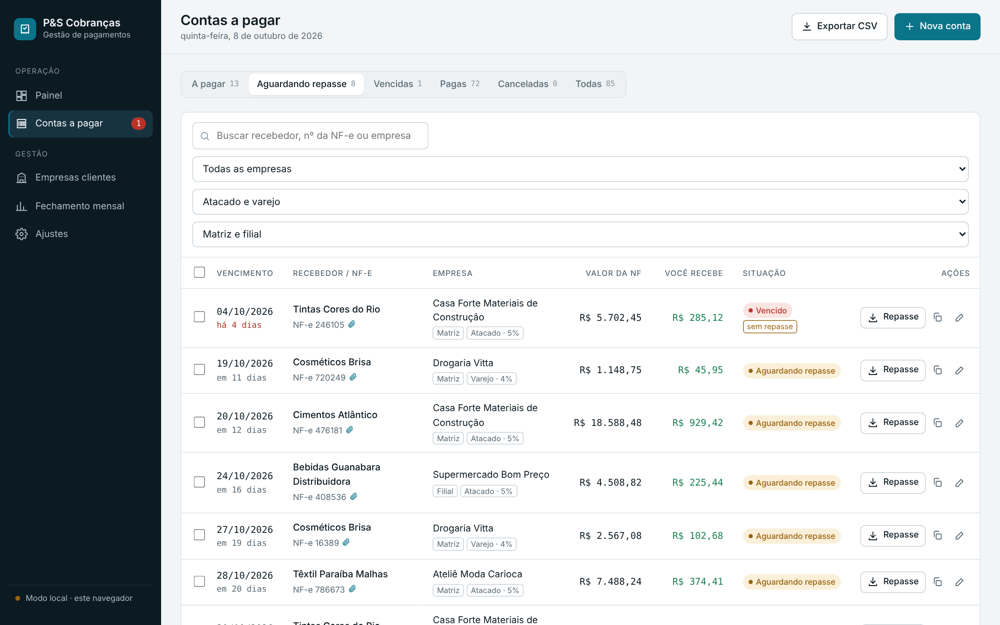

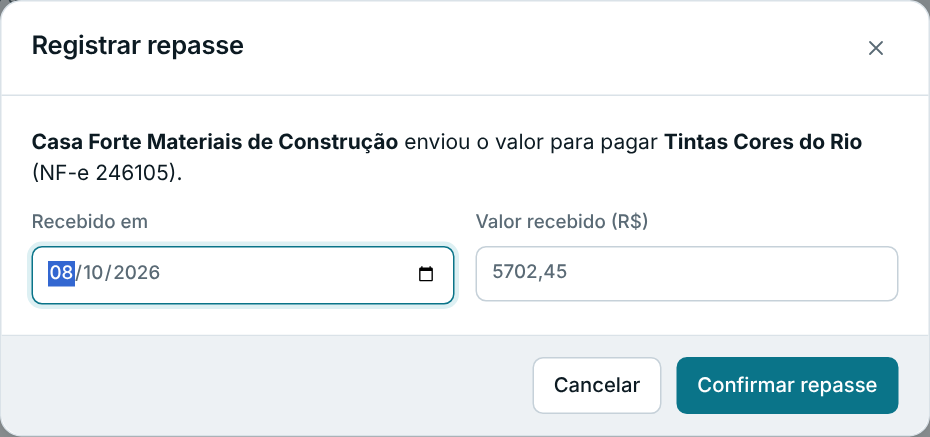

Atalhos: no Painel, o quadro **Aguardando repasse** tem o botão **Recebi** em cada conta. Se a empresa mandou o valor de várias contas de uma vez, marque as caixas à esquerda das contas e use **Repasse recebido** na barra que aparece (veja o passo 4).

## Passo 4: pagar o boleto

Depois de pagar no banco, registre o pagamento no sistema. A aba **A pagar** mostra as contas em aberto em ordem de vencimento.

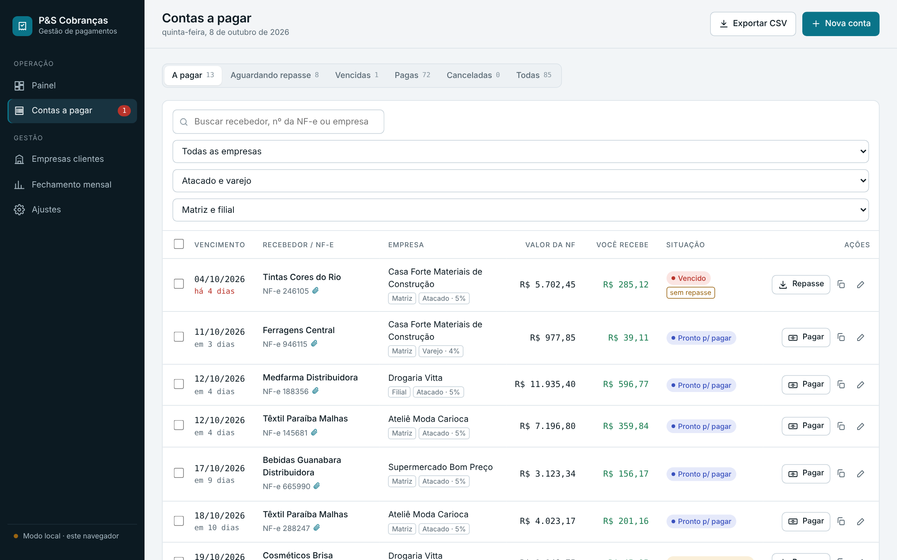

1. Clique no ícone de copiar da conta para levar a **linha digitável** ao app do banco.
2. Pague o boleto no banco.
3. Volte ao sistema e clique em **Pagar** na linha da conta.
4. Confira a data, a forma (PIX, internet banking, DDA…) e o valor pago. Se quiser, anexe o **comprovante**.
5. Clique em **Confirmar pagamento**. A conta vira *Pago* e a sua taxa entra no fechamento do mês.

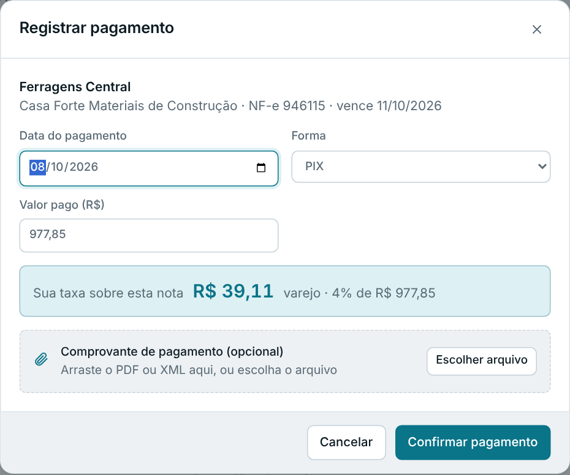

Se a empresa ainda não tiver mandado o valor, a janela avisa em amarelo e oferece marcar o repasse junto.

**Vários pagamentos de uma vez:** marque as caixas à esquerda das contas. Uma barra escura mostra quantas foram selecionadas e o total, com os botões **Repasse recebido** e **Marcar como pagas**.

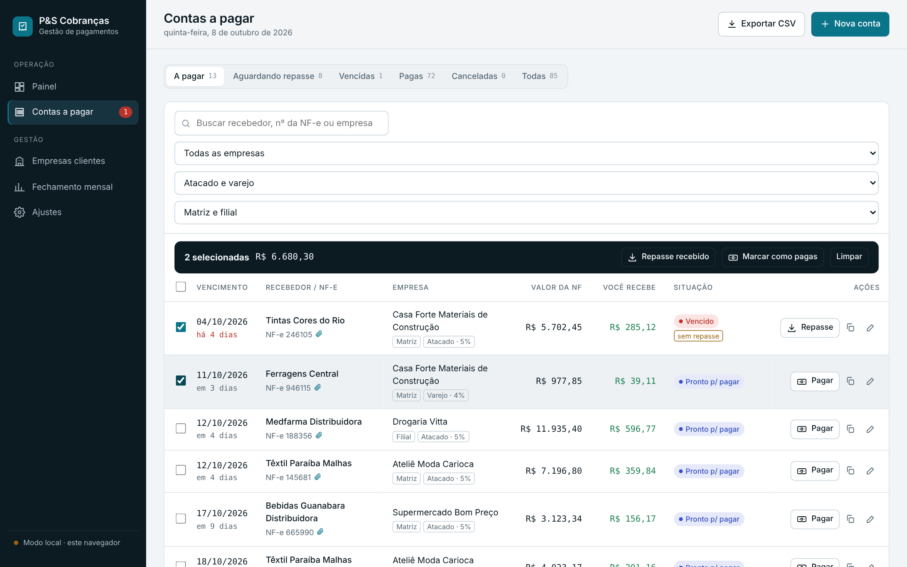

**Ficha da conta:** clicar no nome do recebedor abre a ficha completa: dados, NF-e anexada, linha digitável e o andamento (lançada → repasse → paga → taxa). Por ela você também edita, cancela ou estorna um pagamento lançado errado.

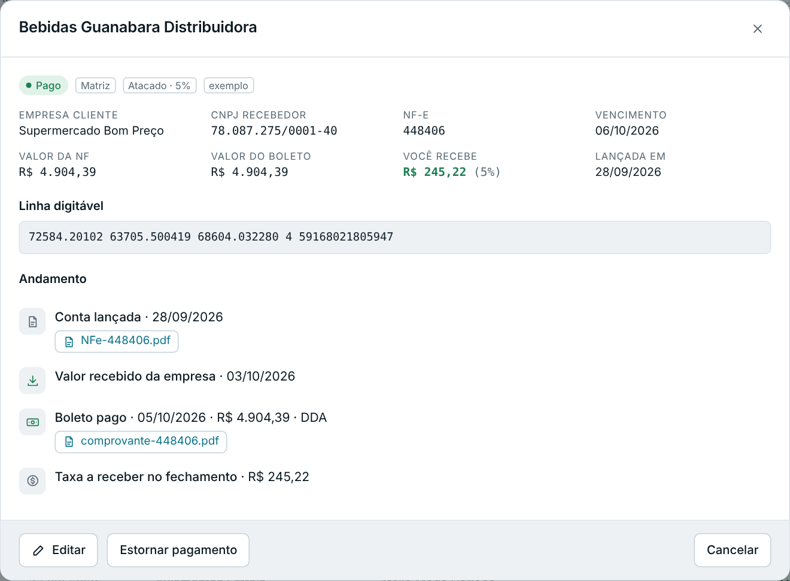

## Passo 5: acompanhar o dia pelo Painel

O Painel é a primeira tela e responde, em segundos, o que precisa ser feito hoje.

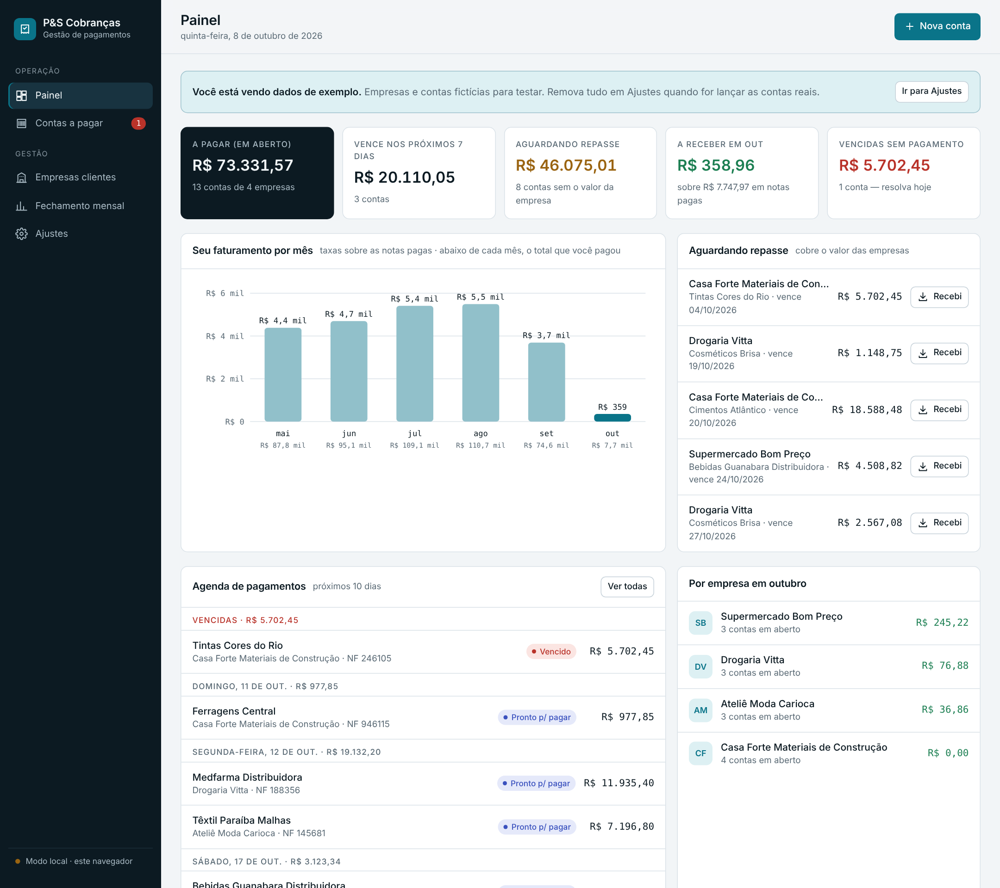

- **Indicadores do topo:** total a pagar, o que vence nos próximos 7 dias, o que aguarda repasse, quanto você recebe no mês e contas vencidas (quando houver).
- **Seu faturamento por mês:** suas taxas nos últimos 6 meses; abaixo de cada mês, o total que você pagou pelas empresas.
- **Aguardando repasse:** empresas que ainda precisam mandar o valor, com o botão **Recebi**.
- **Agenda de pagamentos:** contas dos próximos 10 dias, agrupadas por dia, com as vencidas no topo em vermelho.
- **Por empresa:** a sua taxa do mês em cada cliente.

O número vermelho ao lado de **Contas a pagar**, no menu, conta as contas que vencem hoje ou já venceram.

No celular o sistema funciona igual, com o menu na parte de baixo da tela:

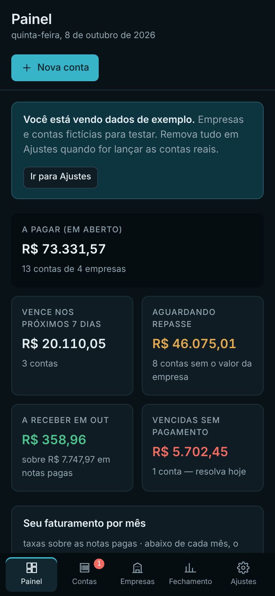

## Passo 6: fechamento mensal e recebimento das taxas

No fim do mês, o Fechamento diz quanto cobrar de cada empresa, sem conta manual.

1. No menu, clique em **Fechamento mensal**.
2. Escolha o mês no seletor. Entram as contas **pagas** naquele mês.
3. Confira, por empresa: quantidade de contas (matriz e filial), notas e taxa de atacado (5%), notas e taxa de varejo (4%) e o **total a receber**.
4. Quando a empresa te pagar, clique em **Marcar recebida** na linha dela.
5. Use **Exportar CSV** para abrir o fechamento no Excel ou enviar à empresa.

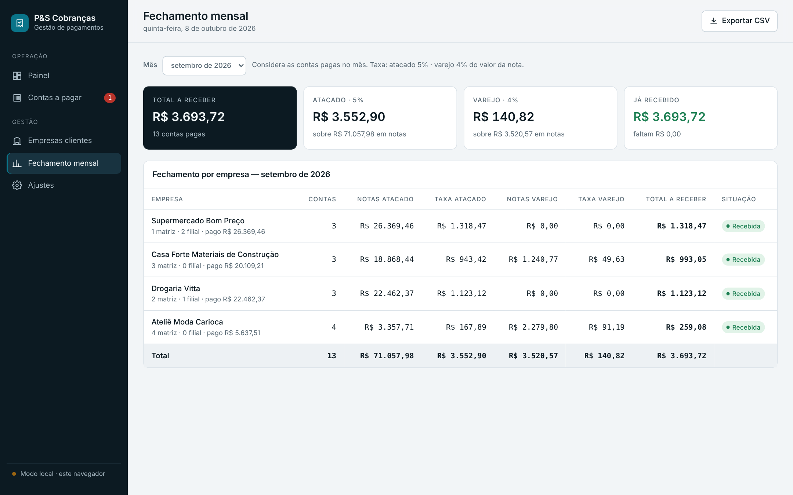

Os quatro quadros do topo resumem o mês: total a receber, taxa de atacado, taxa de varejo e quanto já foi recebido.

A tela Contas a pagar também tem **Exportar CSV**, que exporta exatamente a lista filtrada (por exemplo, só as contas pagas de uma empresa). É útil para manter a planilha antiga atualizada durante a transição.

## Passo 7: ajustes e começo do uso real

Em **Ajustes** você define o nome da empresa (aparece no menu) e os percentuais de atacado e varejo. Mudar um percentual vale para as contas lançadas dali em diante; as antigas guardam o percentual da época, então o histórico não muda.

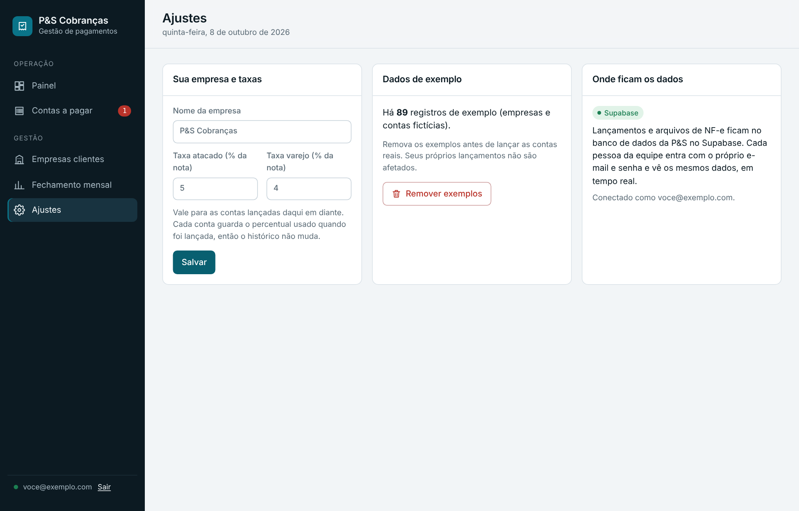

Para começar a usar com dados reais:

- [ ] Se carregou exemplos, clique em **Remover exemplos** em Ajustes (seus lançamentos reais não são afetados)
- [ ] Confira as taxas de 5% e 4%
- [ ] Cadastre as empresas clientes
- [ ] Lance as contas em aberto, anexando as NF-e
- [ ] Cadastre o acesso de cada pessoa da equipe no Supabase ([SUPABASE.md](SUPABASE.md), etapa 4)

## Dicas

- Os dados ficam no Supabase: todas as pessoas da equipe veem as mesmas contas, e uma alteração aparece na tela dos outros na hora.
- Os arquivos de NF-e e comprovantes ficam guardados numa pasta privada; só quem está logado consegue abrir.
- Na lista de contas, combine os filtros (empresa, atacado/varejo, matriz/filial) com a busca por recebedor ou número da NF-e.
- Lançou algo errado? Abra a ficha da conta e use **Editar**, **Cancelar** ou **Estornar pagamento**.
